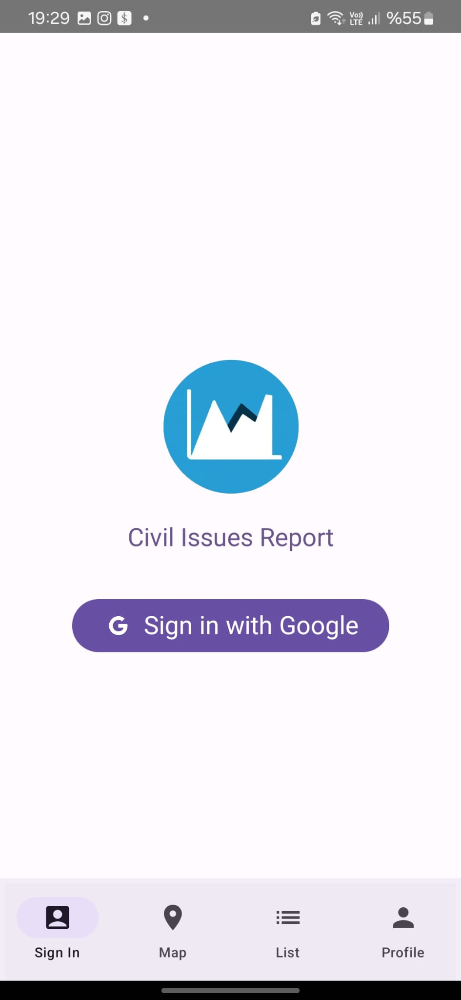
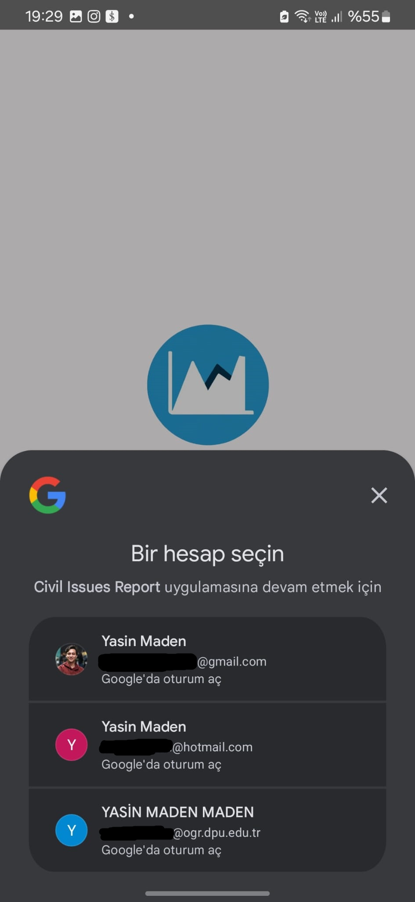
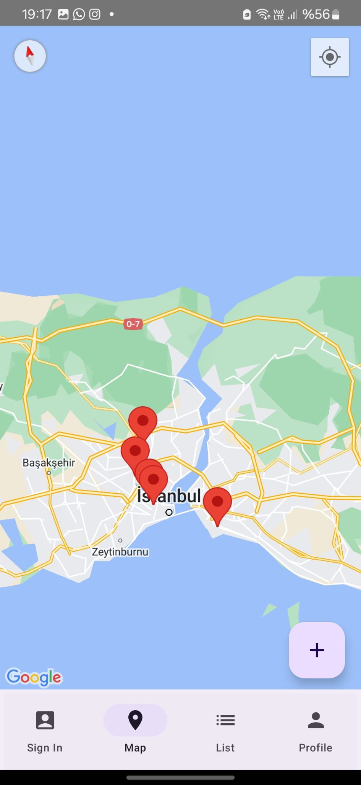
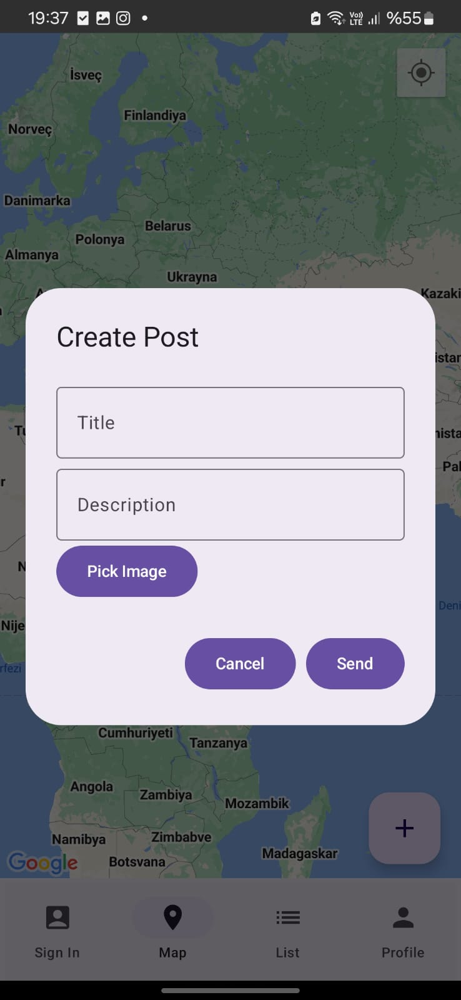
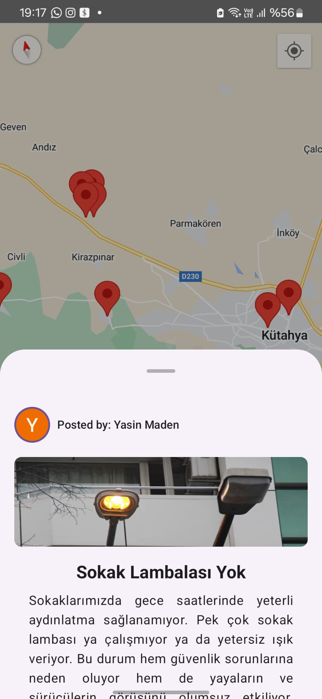
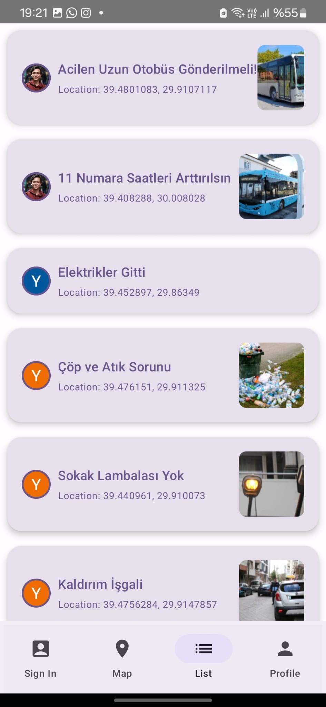
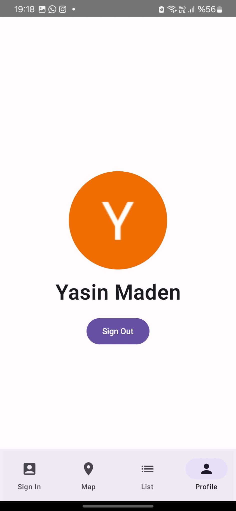

# Civil Issues Reporting Platform

**Status**: Ongoing

## Overview

This project is a mobile application developed using **Kotlin**, **Android**, and **Jetpack Compose**. It is a part of our graduation project that I am developing with my teammate.

The application focuses on integrating maps and location marking capabilities, alongside allowing users to create and share posts containing videos, images, and text on the platform.

## Features

- **Map Integration**: Interactive maps that enable users to view locations and mark specific points of interest.
- **Location Marking**: Users can pin locations and attach information to these markers.
- **Post Creation**: Users can create posts by uploading videos, images, and adding descriptive text.
- **User Interface**: A modern, intuitive UI built with Jetpack Compose.

## Technologies Used

- **Kotlin**: Primary programming language for Android development.
- **Android**: Platform for mobile application development.
- **Jetpack Compose**: Toolkit for building native UI in Android.
- **Google Maps API**: For map and location-based features.
- **Firebase/Backend**: For handling data storage, user authentication, etc.

## Setup and Installation

1. Clone the repository:
   ```bash
   git clone https://github.com/madenyasin/report/

## Screenshots

 





